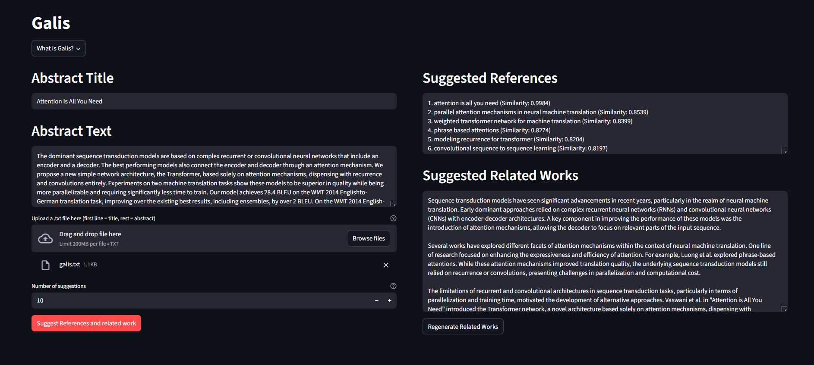

# Galis



## Project Description
<strong>GALIS (Graph-Aware Language Intelligence System for Research Synthesis)</strong> is a web-based application designed to streamline and improve the creation of related work and references sections in computer science research papers. It leverages an existing semantic graph that captures the relationships and core concepts among cited papers to guide language model outputs. 

<strong>The primary objective</strong> is to provide a practical tool that helps researchers generate high-quality, coherent related work and references sections, making the process of synthesizing literature more efficient and insightful.**

## Deployed Demo

A publicly deployed demo for the <strong>GALIS</strong> (Graph-Aware Language Intelligence System for Research Synthesis): https://huggingface.co/spaces/Perunio/galis

## Dataset Information
<strong>GALIS</strong> utilizes the <strong>OGBN-ArXiv (Open Graph Benchmark)</strong> dataset. This benchmark dataset represents a citation network of computer science papers from arXiv, providing node features, citation edges, and research area labels. It is used for training and evaluation within the project to ensure the semantic graph accurately captures the intricate relationships within CS literature.

## Setting Up the Project Locally on <strong>Linux</strong>

### Prerequisites
- <strong>Docker</strong> 
- <strong>Python 3.9</strong> or higher
- <strong>Poetry</strong> tool for dependency management and packaging
  
### Step 1:

Install required dependencies with ```Makefile```

```bash
make install
```

### Step 2:

- Create ```.env``` file

- Go to your Google AI Studio account
- Generate API key
- Copy and past that on ```GOOGLE_API_KEY``` variable in ```.env``` file (see ```.env_template```)

```
GOOGLE_API_KEY=your_api_key
```

### Start with <strong>Docker</strong>

- Run your <strong>Docker Desktop</strong> application

- This command builds a Docker image for the application.

```bash
make docker-build
```

- This command runs the application inside a Docker container

```bash
make docker-run
```

### Alternative: Running the Application Locally

This command will run application on ```Network URL: http://172.20.139.226:8501```
```bash
make run-app
```

This command will run demo on ```Network URL: http://172.20.139.226:8501```
```bash
make demo
```

### Created by

- [Remigiusz Sęk](<https://github.com/remigiuszsek>)
- [Kacper Gutowski](<https://github.com/Perunio>)
- [Dawid Koterwas](<https://github.com/Kiwinicki>)
- [Andrii Norets](<https://github.com/AndriiNorets>)